# LR1

  - [1. Создать консольное приложение. Название проекта: \_НомерГруппы\_Фамилия.](#1-создать-консольное-приложение-название-проекта-_номергруппы_фамилия)
  - [2. Ознакомиться со структурой проекта.](#2-ознакомиться-со-структурой-проекта)
  - [3. Найти файл \*.csproj. Найдите в нем указание на целевую платформу и тип приложения.](#3-найти-файл-csproj-найдите-в-нем-указание-на-целевую-платформу-и-тип-приложения)
  - [4. Добавьте в проект NuGet пакет AutoMapper. Найдите ссылку на установленный пакет в файле \*.csproj](#4-добавьте-в-проект-nuget-пакет-automapper-найдите-ссылку-на-установленный-пакет-в-файле-csproj)
  - [5. Написать программу, которая выводит в консоль частное от деления чисел, введенных с клавиатуры. Введенные данные и результат сохранять в отдельных переменных.](#5-написать-программу-которая-выводит-в-консоль-частное-от-деления-чисел-введенных-с-клавиатуры-введенные-данные-и-результат-сохранять-в-отдельных-переменных)
  - [6. Запустить проект в двух режимах: с отладкой и без отладки. Ввести сначала корректные, а затем заведомо неправильные значения чисел (строка вместо числа, ноль в качестве делителя). Сравнить результат в режиме отладки и выпуска.](#6-запустить-проект-в-двух-режимах-с-отладкой-и-без-отладки-ввести-сначала-корректные-а-затем-заведомо-неправильные-значения-чисел-строка-вместо-числа-ноль-в-качестве-делителя-сравнить-результат-в-режиме-отладки-и-выпуска)
  - [7. Найти скомпилированные файлы (для режима отладки и режима выпуска)](#7-найти-скомпилированные-файлы-для-режима-отладки-и-режима-выпуска)
  - [8. Поставить точки останова. Запустить проект в двух режимах: с отладкой и без отладки. Сравнить результат. Прочитать в отладчике значения переменных. Провести пошаговое выполнение программы.](#8-поставить-точки-останова-запустить-проект-в-двух-режимах-с-отладкой-и-без-отладки-сравнить-результат-прочитать-в-отладчике-значения-переменных-провести-пошаговое-выполнение-программы)


## 1. Создать консольное приложение. Название проекта: _НомерГруппы_Фамилия.

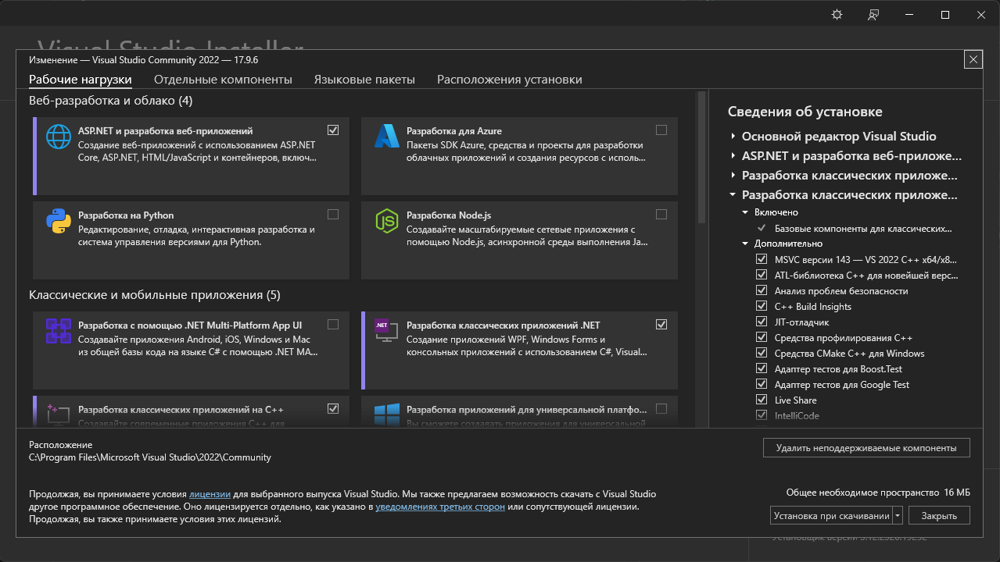

Для начала работы нужно было добавить компонент `Разработка классических приложений .NET`

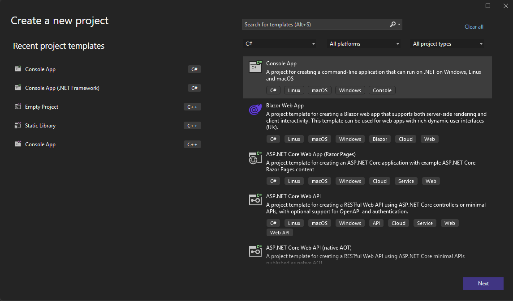

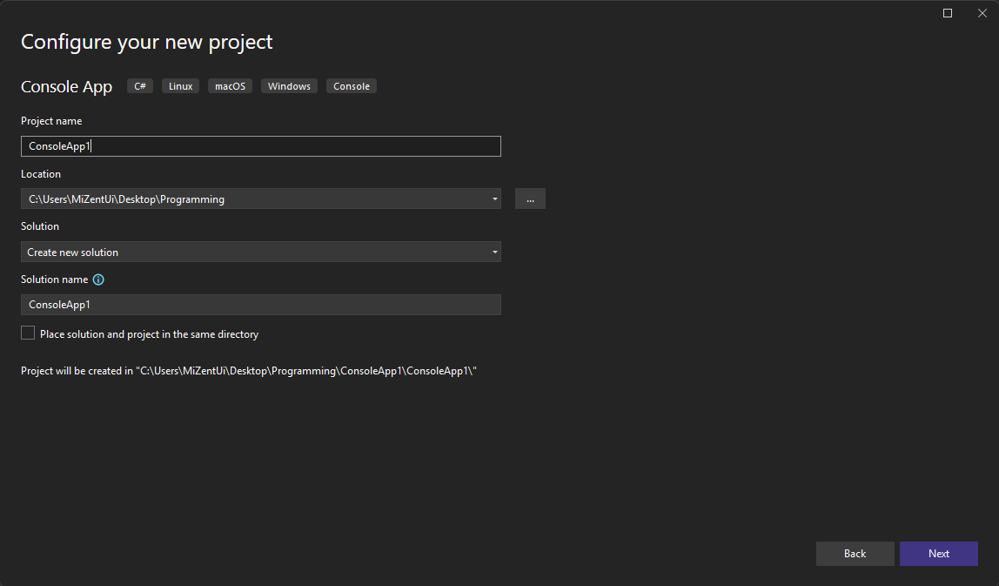

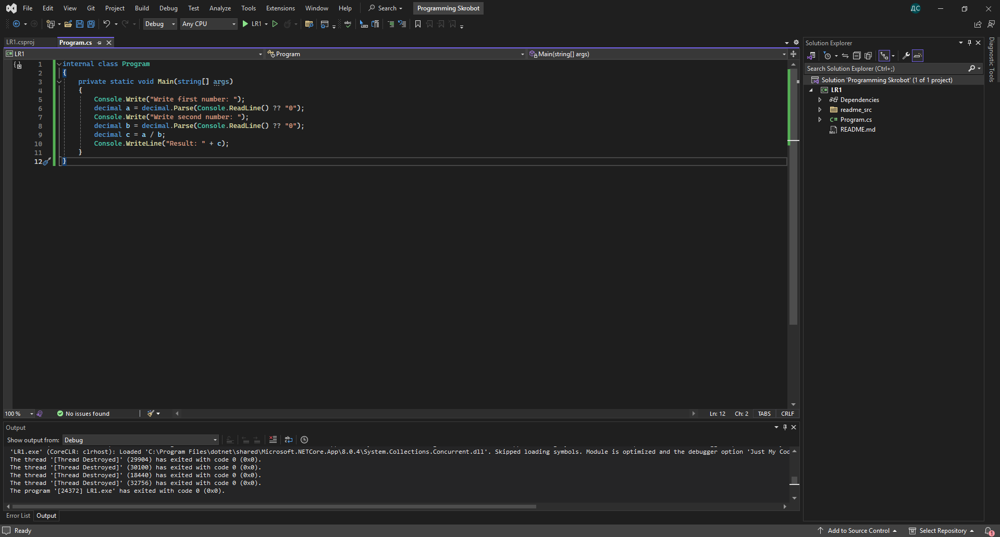

Далее шла классический процесс создания проекта 

## 2. Ознакомиться со структурой проекта.
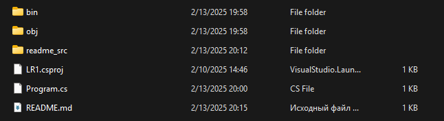

`bin` - (*binary*) содержит результат сборки проекта - исполняемые (двоичные) файлы <br>
`obj` - (*objects*) содержит временные объектные файлы, которые используются для компиляции исполняемых файлов <br>
`LR1.csproj` - (*csharp project*) - содержит конфигурацию проекта <br>
`Program.cs` - файл (класс) с кодом

## 3. Найти файл *.csproj. Найдите в нем указание на целевую платформу и тип приложения.

```xml
<Project Sdk="Microsoft.NET.Sdk">

  <PropertyGroup>
    <OutputType>Exe</OutputType>
    <TargetFramework>net8.0</TargetFramework>
    <ImplicitUsings>enable</ImplicitUsings>
    <Nullable>enable</Nullable>
  </PropertyGroup>

  <ItemGroup>
    <PackageReference Include="AutoMapper" Version="13.0.1" />
  </ItemGroup>

</Project>
```

`OutputType` - тип приложения <br>
`TargetFramework` - целевая платформа 

## 4. Добавьте в проект NuGet пакет AutoMapper. Найдите ссылку на установленный пакет в файле *.csproj

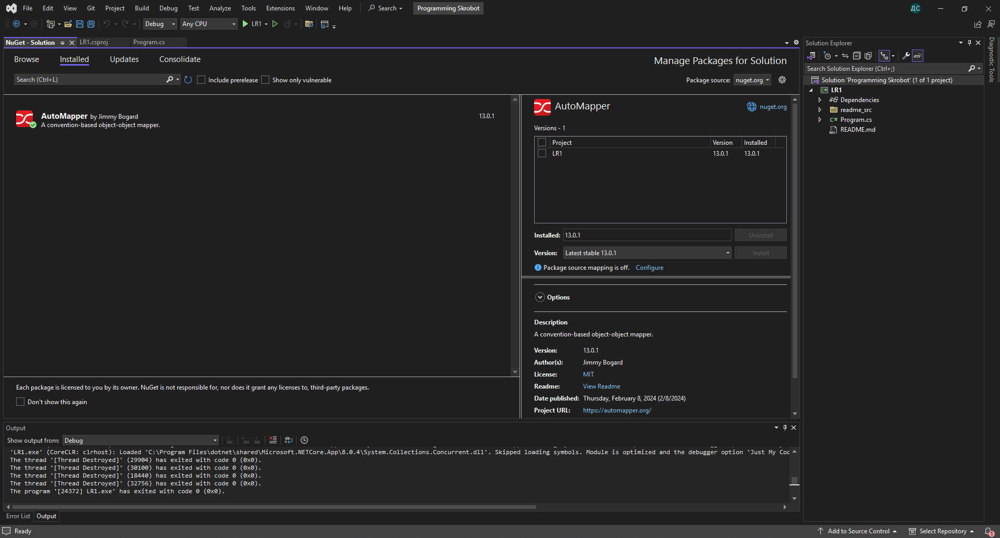

Для установки `AutoMapper` я использовал графический пакетный менеджер `Nuget`

```xml
<Project Sdk="Microsoft.NET.Sdk">

  <PropertyGroup>
    <OutputType>Exe</OutputType>
    <TargetFramework>net8.0</TargetFramework>
    <ImplicitUsings>enable</ImplicitUsings>
    <Nullable>enable</Nullable>
  </PropertyGroup>

  <ItemGroup>
    <PackageReference Include="AutoMapper" Version="13.0.1" />
  </ItemGroup>

</Project>
```

`PackageReference` - ссылка на пакет, именно здесь указывается на какой пакет и его версия

## 5. Написать программу, которая выводит в консоль частное от деления чисел, введенных с клавиатуры. Введенные данные и результат сохранять в отдельных переменных.

```cs
internal class Program
{
	private static void Main(string[] args)
	{
		Console.Write("Write first number: ");
		decimal a = decimal.Parse(Console.ReadLine() ?? "0");
		Console.Write("Write second number: ");
		decimal b = decimal.Parse(Console.ReadLine() ?? "0");
		decimal c = a / b;
		Console.WriteLine("Result: " + c);
	}
}
```

## 6. Запустить проект в двух режимах: с отладкой и без отладки. Ввести сначала корректные, а затем заведомо неправильные значения чисел (строка вместо числа, ноль в качестве делителя). Сравнить результат в режиме отладки и выпуска.

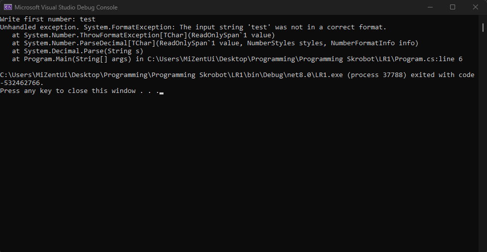
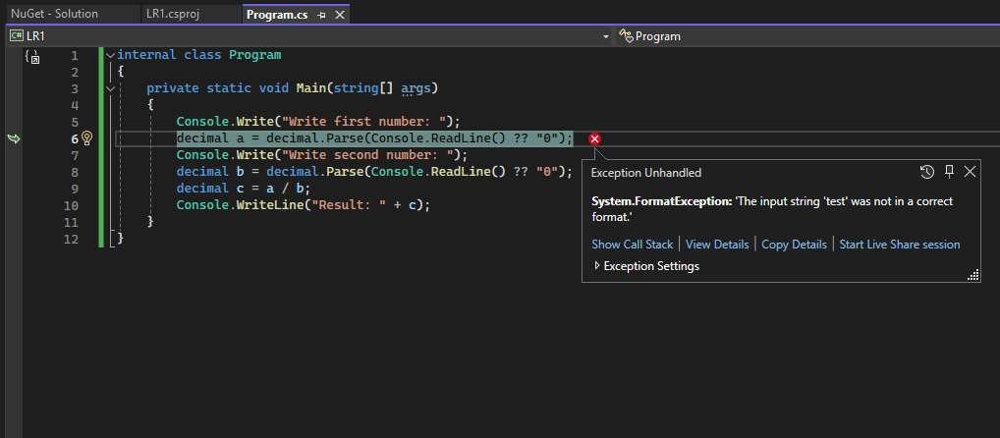

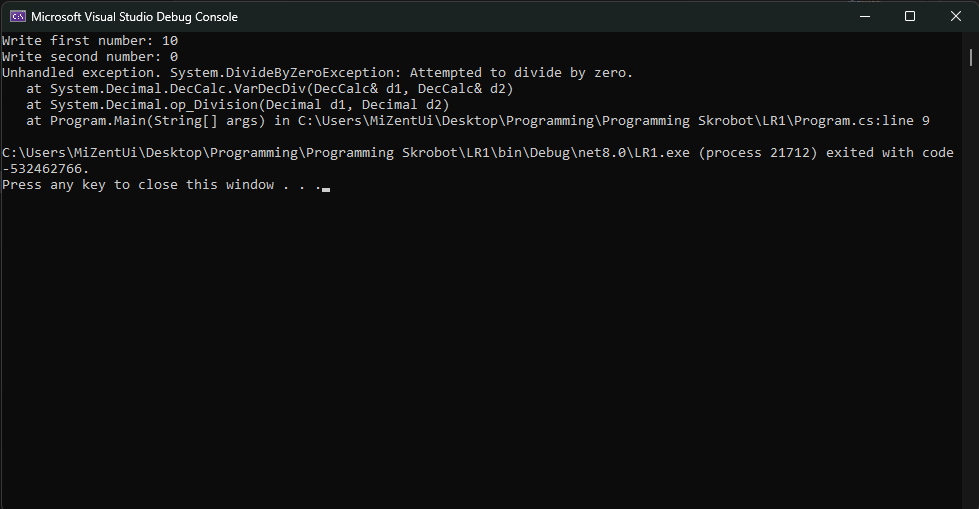
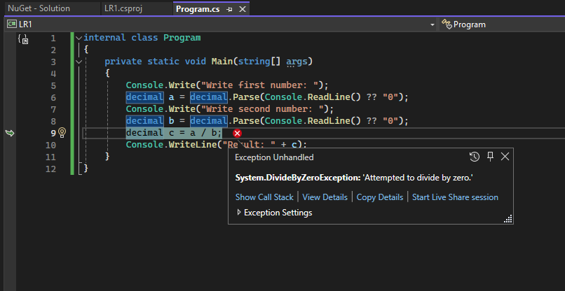

При возникновении ощибки вызывается исключение. Основным отличием при запуске с отладкой и без является, то что при отладке это исключение выводится в IDE, а без отладки - в консоль.

## 7. Найти скомпилированные файлы (для режима отладки и режима выпуска)

Мне лень вставлять скриншот, в общем они в папке `bin`

## 8. Поставить точки останова. Запустить проект в двух режимах: с отладкой и без отладки. Сравнить результат. Прочитать в отладчике значения переменных. Провести пошаговое выполнение программы.

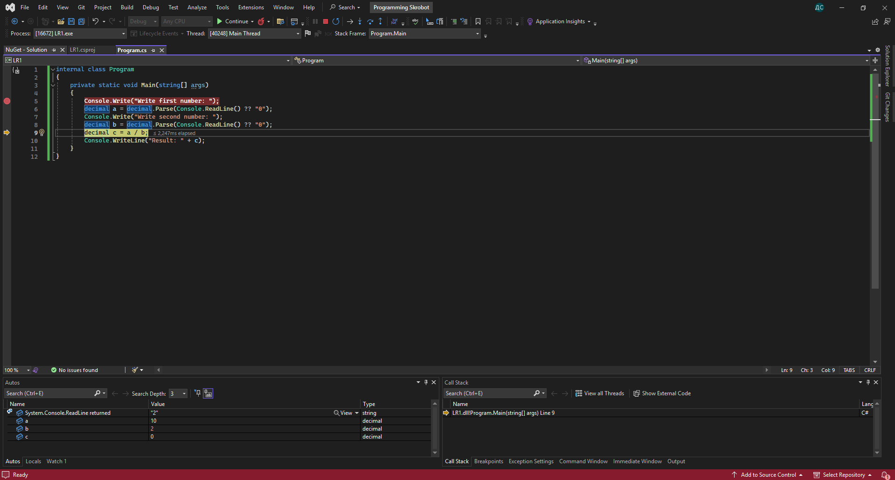

Точки останова могут приостановить выполнение программы только в случае её запуска в режиме отладки